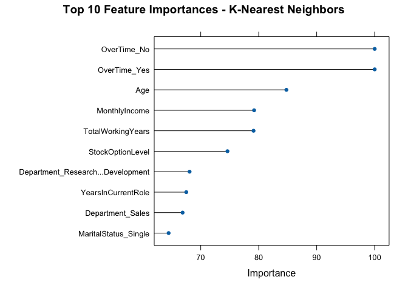

Frito Lay: Customer Attrition - Multivariate Analysis
================

``` r
library(tidyverse)
library(tidymodels)  # recipes, parsnip, workflows, yardstick, tune, rsample
library(themis)
library(kknn)        # KNN engine
library(naivebayes) 
library(caret)
set.seed(123)
```

------------------------------------------------------------------------

### ———— Data Loading ————-

``` r
getwd()
```

    ## [1] "/Users/cory/Projects/DDSAnalytics_customer_attrition/notebooks"

``` r
data <- read.csv("../data/CaseStudy1-data.csv")
```

------------------------------------------------------------------------

### ———— KNN Modeling ————-

``` r
set.seed(123)

# Target factor with "Yes" as positive/event class
data$Attrition <- relevel(factor(data$Attrition), ref = "Yes")

# ---- Split (stratified) ----
idx   <- createDataPartition(data$Attrition, p = 0.7, list = FALSE)
train <- data[idx, ]
test  <- data[-idx, ]

# ---- Recipe (preprocessing pipeline) ----
attrition_rec <- recipe(Attrition ~ ., data = train) %>%
  step_string2factor(all_nominal_predictors()) %>%
  step_nzv(all_predictors()) %>%
  step_dummy(all_nominal_predictors(), one_hot = TRUE) %>%
  # step_corr(all_numeric_predictors(), threshold = 0.9) %>%
  # step_normalize(all_numeric_predictors(), -all_outcomes()) %>%
  step_range(all_numeric_predictors(), -all_outcomes(), min = 0, max = 1) %>% 
  step_tomek(Attrition) %>%
  step_upsample(Attrition, over_ratio = 1)

f1_summary <- function(data, lev = NULL, model = NULL) {
  precision <- posPredValue(data$pred, data$obs, positive = lev[1])
  recall    <- sensitivity(data$pred, data$obs, positive = lev[1])
  f1        <- (2 * precision * recall) / (precision + recall)

  c(F1 = f1)
}

ctrl <- trainControl(
  method = "cv",
  number = 10,
  summaryFunction = f1_summary,
  classProbs = FALSE,
  savePredictions = "final"
)

# ---- K tuning grid ----
grid <- expand.grid(k = seq(3, 100, by = 3))

# ---- Train KNN with recipe + CV ----
set.seed(42)

knn_model <- train(
  attrition_rec,
  data = train,
  method = "knn",
  trControl = ctrl,
  tuneGrid = grid,
  metric = "F1"
)

# ---- Evaluate on unseen test ----
pred_test <- predict(knn_model, newdata = test)
confusionMatrix(pred_test, test$Attrition, positive = "Yes")
```

    ## Confusion Matrix and Statistics
    ## 
    ##           Reference
    ## Prediction Yes  No
    ##        Yes  27  66
    ##        No   15 153
    ##                                           
    ##                Accuracy : 0.6897          
    ##                  95% CI : (0.6297, 0.7453)
    ##     No Information Rate : 0.8391          
    ##     P-Value [Acc > NIR] : 1               
    ##                                           
    ##                   Kappa : 0.2291          
    ##                                           
    ##  Mcnemar's Test P-Value : 2.767e-08       
    ##                                           
    ##             Sensitivity : 0.6429          
    ##             Specificity : 0.6986          
    ##          Pos Pred Value : 0.2903          
    ##          Neg Pred Value : 0.9107          
    ##              Prevalence : 0.1609          
    ##          Detection Rate : 0.1034          
    ##    Detection Prevalence : 0.3563          
    ##       Balanced Accuracy : 0.6707          
    ##                                           
    ##        'Positive' Class : Yes             
    ## 

------------------------------------------------------------------------

### ———— KNN Feature Importance ————-

``` r
# Extract feature importance from the Naive Bayes model
importance_nb <- varImp(knn_model)

# View top 10 most important features
print(importance_nb)
```

    ## ROC curve variable importance
    ## 
    ##   only 20 most important variables shown (out of 53)
    ## 
    ##                                   Importance
    ## OverTime_No                           100.00
    ## OverTime_Yes                          100.00
    ## Age                                    84.77
    ## MonthlyIncome                          79.20
    ## TotalWorkingYears                      79.11
    ## StockOptionLevel                       74.61
    ## Department_Research...Development      68.07
    ## YearsInCurrentRole                     67.50
    ## Department_Sales                       66.87
    ## MaritalStatus_Single                   64.46
    ## ID                                     61.84
    ## DistanceFromHome                       58.83
    ## YearsWithCurrManager                   58.38
    ## YearsAtCompany                         57.38
    ## JobRole_Sales.Representative           56.02
    ## JobLevel                               51.49
    ## MaritalStatus_Divorced                 51.20
    ## JobSatisfaction                        44.06
    ## JobInvolvement                         41.60
    ## Gender_Female                          40.36

``` r
plot(importance_nb, top = 10, main = "Top 10 Feature Importances - K-Nearest Neighbors")
```

<!-- -->

------------------------------------------------------------------------

### ———— KNN Training/Test Data Sanity Check ————-

``` r
# Prep the recipe on the training data
rec_prep <- prep(attrition_rec)

# View the transformed training data
train_processed <- bake(rec_prep, new_data = NULL)
table(train_processed$Attrition)
```

    ## 
    ## Yes  No 
    ## 479 479

``` r
# View the transformed test data (same preprocessing)
test_processed <- bake(rec_prep, new_data = test)

table(test_processed$Attrition)
```

    ## 
    ## Yes  No 
    ##  42 219
