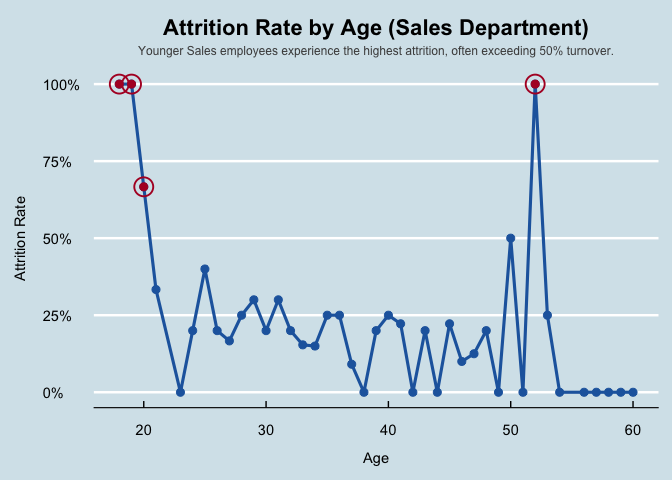

Frito Lay: Customer Attrition - Multivariate Analysis
================

``` r
library(tidyverse)
library(caret)
library(e1071)
library(class)
library(scales)
library(ggthemes)
theme_set(theme_economist())
title_format <- function(x) labs(title = x, x = NULL, y = NULL)
```

## ———— Data Loading ————-

``` r
# getwd()
data <- read.csv("../data/CaseStudy1-data.csv")
```

------------------------------------------------------------------------

## ———— Multivariate Analysis ————-

Multivariate analysis explores how multiple factors interact to
influence employee attrition. By examining combinations of demographic,
compensation, and work-related variables together, it reveals deeper
relationships—such as how overtime, tenure, and income jointly affect
turnover—providing a more complete view of the underlying drivers of
employee loss.

------------------------------------------------------------------------

### Attrition by Department and OverTime

Question:

How does the Attrition rate vary across different Departments and
OverTime status? The following heatmap visualizes this relationship:

``` r
# Calculating attrition rate by Department and OverTime group
df1 <- data %>%
  group_by(Department, OverTime) %>%
  summarise(attr_rate = mean(Attrition == "Yes"), .groups = "drop")

# Creating a heatmap to visualize attrition patterns by Department and OverTime
ggplot(df1, aes(Department, OverTime, fill = attr_rate)) +
  geom_tile(color = "white") +  
  scale_fill_gradient(
    low = "#d8e6f3", 
    high = "#b2182b", 
    labels = percent  
  ) +
  labs(
    title = "Attrition Rate by Department and OverTime",
    fill = "Attrition Rate Percentage"
  ) +
  theme(
    # Center and bold the plot title with slight spacing below
    plot.title = element_text(
      hjust = 0.5,
      face = "bold", 
      margin = margin(b = 10)
    ),
    # Formating legend text and size
    legend.title = element_text(size = 9, face = "bold"),
    legend.text = element_text(size = 8),
    legend.key.width = unit(1, "cm"),
    legend.key.height = unit(0.4, "cm"),
    # Adding padding around axis titles for readability
    axis.title.x = element_text(margin = margin(t = 12)),
    axis.title.y = element_text(margin = margin(r = 12)),
  )
```

<!-- -->

This heatmap illustrates how attrition rates vary across departments and
overtime status. The darkest red shading represents the highest
attrition percentages. Employees in the Sales department who work
overtime experience the highest attrition rate, exceeding 40%. In
contrast, Research & Development employees with no overtime show the
lowest attrition, suggesting that work-life balance plays a key role in
retention. Across all departments, overtime consistently correlates with
higher attrition, but the impact is most pronounced in Sales—indicating
that targeted workload management and incentive strategies in Sales
could potentially yield meaningful reductions in turnover.

------------------------------------------------------------------------

### Attrition Rate by Age for Sales Employees

Question:

How does the attrition rate vary by age among Sales department
employees?

``` r
# Compute attrition rate by age for Sales employees only
df_age_sales <- data %>%
  filter(Department == "Sales") %>%
  group_by(Age) %>%
  summarise(attr_rate = mean(Attrition == "Yes"), .groups = "drop")
# Plotting Attrition Rate by Age for Sales Employees
ggplot(df_age_sales, aes(x = Age, y = attr_rate)) +
  geom_line(color = "#2166ac", size = 1.1) +
  geom_point(color = "#2166ac", size = 2.5) +
  geom_point(
    data = df_age_sales %>% filter(attr_rate > 0.5),
    aes(x = Age, y = attr_rate),
    color = "#b2182b",
    size = 2.5
  ) +
  geom_point(
    data = df_age_sales %>% filter(attr_rate > 0.5),
    aes(x = Age, y = attr_rate),
    shape = 21,
    size = 6,
    stroke = 1,
    color = "#b2182b",
    fill = NA
  ) +
  scale_y_continuous(labels = scales::percent_format(accuracy = 1)) +
  labs(
    title = "Attrition Rate by Age (Sales Department)",
    subtitle = "Younger Sales employees experience the highest attrition, often exceeding 50% turnover.",
    x = "Age",
    y = "Attrition Rate"
  ) +
  theme_economist() +
  theme(
    plot.title = element_text(
      hjust = 0.5,
      face = "bold",
      margin = margin(b = 6)
    ),
    plot.subtitle = element_text(
      hjust = 0.5,
      size = 9,
      color = "gray30",
      margin = margin(b = 10)
    ),
    axis.title.x = element_text(margin = margin(t = 12)),
    axis.title.y = element_text(margin = margin(r = 12))
  )
```

<!-- -->

This line chart reveals a clear age-related trend in attrition within
the Sales department. Younger employees—particularly those under
25—experience significantly higher turnover rates, in several cases
exceeding 50% and even approaching full attrition. These sharp
early-career exits suggest potential challenges in onboarding, job
expectations, or early compensation satisfaction. In contrast,
mid-career employees between ages 30 and 45 show much lower and more
stable attrition rates, indicating stronger retention once employees
establish tenure and familiarity with their roles. The resurgence of
attrition among older sales staff (around age 50) may reflect career
transitions or retirement considerations. Overall, this pattern
underscores the importance of targeted retention programs for younger
sales employees, such as enhanced mentorship, clearer advancement
pathways, and performance-linked incentives.

------------------------------------------------------------------------

### Income Distribution for Sales Employees by Attrition

Question:

Do income levels differ significantly between employees who stay and
those who leave within the Sales department?

``` r
# Boxplot to compare Monthly Income distribution for Sales employees by Attrition status
ggplot(data %>% filter(Department == "Sales"),
       aes(x = Attrition, y = MonthlyIncome, fill = Attrition)) +
  # Creating notched boxplots to visualize distribution and median confidence intervals
  geom_boxplot(
    color = "black",
    outlier.shape = 16,
    outlier.color = "black",
    outlier.size = 2,
    notch = TRUE,
    notchwidth = 0.9
  ) +
  scale_fill_manual(
    values = c("Yes" = "#b2182b", "No" = "#2166ac")
  ) +
  # Format y-axis values as dollar amounts
  scale_y_continuous(labels = dollar_format(prefix = "$", big.mark = ",")) +

  # Add median labels to each box for clarity
  stat_summary(
    fun = median,
    geom = "label",
    aes(label = paste0("Median: $", format(round(..y.., 0), big.mark = ","))),
    color = "black",
    fill = "white",
    fontface = "bold",
    size = 4,
    label.size = 0.1,
    vjust = -0.5
  ) +
  labs(
    title = "Income Distribution for Sales Employees by Attrition",
    x = "Attrition",
    y = "Monthly Income"
  ) +
  theme(
    plot.title = element_text(
      hjust = 0.5,
      face = "bold",
      margin = margin(b = 10)
    ),
    legend.position = "none",
    axis.title.x = element_text(margin = margin(t = 12)),
    axis.title.y = element_text(margin = margin(r = 12))
  )
```

<!-- -->

This boxplot provides a clear comparison of monthly income between Sales
employees who stayed and those who left the company. The median income
for employees who did not leave is approximately \$5,900, whereas those
who left have a notably lower median of \$4,700. These findings
reinforce an idea that lower compensation may be a significant driver of
attrition in the Sales department, highlighting an opportunity for Frito
Lay to improve retention through targeted pay adjustments or incentive
structures.

------------------------------------------------------------------------

### Attrition by Job Role and Education Field

Question:

How does the attrition rate vary across different Job Roles and
Education Fields?

``` r
# Calculating attrition rate by Job Role and Education Field
df2 <- data %>%
  group_by(JobRole, EducationField) %>%
  summarise(attr_rate = mean(Attrition == "Yes"), .groups = "drop")

# Plotting a Heatmap to visualize 
ggplot(df2, aes(EducationField, JobRole, fill = attr_rate)) +
  geom_tile(color = "white") +   
  scale_fill_gradient(
    low  = "#d8e6f3",            
    high = "#b2182b",            
    labels = percent             
  ) +
  labs(
    title = "Attrition Rate by Job Role and Education Field",
    fill  = "Attrition Rate Percentage"
  ) +
  theme(
    # Tweaking plot appearance
    plot.title = element_text(hjust = 0.5, face = "bold", margin = margin(b = 10)),
    legend.position = "top",
    legend.justification = "center",
    legend.title = element_text(size = 9, face = "bold"),
    legend.text  = element_text(size = 8),
    legend.key.width  = unit(1, "cm"),
    legend.key.height = unit(0.4, "cm"),
    # Improve x-axis label readability
    axis.text.x  = element_text(angle = 45, hjust = 1, vjust = 1, size = 9),
    axis.title.x = element_text(margin = margin(t = 12)),
    axis.title.y = element_text(margin = margin(r = 12)),
    # Balancing white space left/right (long y labels widen the left side)
    plot.margin  = margin(t = 5, r = 75, b = 5, l = 5)
  )
```

<!-- -->

This visualization highlights that attrition risk is not evenly
distributed across job roles or educational backgrounds. Employees in
sales-related roles—particularly Sales Representatives with Medical or
Technical degrees—show the highest turnover rates. Conversely, employees
in research and management positions display significantly lower
attrition, indicating stronger role alignment and job stability. These
insights suggest that retention efforts may need to focus on improving
engagement, career development, and growth opportunities for technically
trained employees in high-turnover sales positions.

------------------------------------------------------------------------

# Heatmap of Job Satisfaction vs Environment Satisfaction for Sales Representatives

Question:

Why do Sales Representatives experience high attrition? How do Job
Satisfaction and Environment Satisfaction levels impact their attrition
rates?

``` r
# Subsetting data for Sales Representatives and calculating attrition rates
df_salesrep <- data %>%
  filter(Department == "Sales", JobRole == "Sales Representative") %>%
  group_by(JobSatisfaction, EnvironmentSatisfaction) %>%
  summarise(attr_rate = mean(Attrition == "Yes"), .groups = "drop")

ggplot(df_salesrep, aes(factor(JobSatisfaction), factor(EnvironmentSatisfaction), fill = attr_rate)) +
  geom_tile(color = "white") +
  scale_fill_gradient(low = "#d8e6f3", high = "#b2182b", labels = percent) +
  labs(
    title = "Satisfaction Levels Vs Attrition Rate",
    subtitle = "Sale Department: Sales Representative Role",
    x = "Job Satisfaction (1 = Low, 4 = High)",
    y = "Environment Satisfaction (1 = Poor, 4 = Excellent)",
    fill = "Attrition Rate"
  ) +
  theme(
    plot.title = element_text(hjust = 0.5, face = "bold", margin = margin(b = 10)),
    plot.subtitle = element_text(hjust = 0.5, face = "bold", margin = margin(b = 10)),
    legend.title = element_text(size = 9, face = "bold"),
    legend.text = element_text(size = 8),
    legend.key.width = unit(1, "cm"),
    legend.key.height = unit(0.4, "cm"),
    axis.title.x = element_text(margin = margin(t = 12)),
    axis.title.y = element_text(margin = margin(r = 12))
  )
```

<!-- -->

This visualization examines how job satisfaction and environment
satisfaction jointly affect attrition among Sales Representatives within
the Sales department. Each cell represents the average attrition rate
for employees with a specific pairing of satisfaction levels (ranging
from 1 = Low to 4 = High).

Low satisfaction levels—particularly when both job and environment
satisfaction are rated 1 or 2—are associated with the highest attrition
rates, often exceeding 50%.

Conversely, employees who report higher satisfaction (levels 3 or 4) in
both categories exhibit a lower turnover - with a few exceptions to
explore.

The transition from deep red to lighter blue tones underscores how even
moderate improvements in either satisfaction measure can sharply reduce
attrition risk.

In practical terms, this pattern suggests that dissatisfaction compounds
attrition risk—when Sales Representatives feel both undervalued in their
work and unsupported in their environment, they are far more likely to
leave. Improving workplace conditions, recognition programs, and support
systems may therefore be as crucial to retention as compensation or
career advancement opportunities.

------------------------------------------------------------------------
