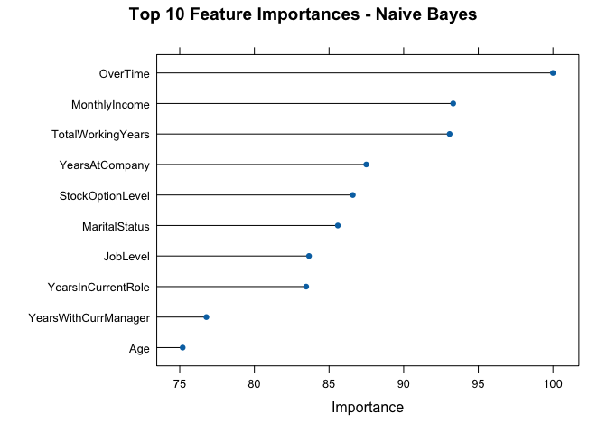

Frito Lay: Customer Attrition - Multivariate Analysis
================

``` r
library(tidyverse)
library(caret)
library(e1071)
library(class)
library(naivebayes)
library(scales)
library(ggthemes)
theme_set(theme_economist())
title_format <- function(x) labs(title = x, x = NULL, y = NULL)
```

------------------------------------------------------------------------

### ———— Data Loading ————-

``` r
data <- read.csv("../data/CaseStudy1-data.csv")
```

------------------------------------------------------------------------

### ————- Remove Low Variance and Constant Features ————-

``` r
# Check if each column contains only unique values
unique_check <- sapply(data, function(x) length(unique(x)) == nrow(data))

# Check if each column contains only one unique value
constant_check <- sapply(data, function(x) length(unique(x)) == 1)

col_check <- list(
  constant = names(data)[constant_check],
  unique = names(data)[unique_check]
)

col_check
```

    ## $constant
    ## [1] "EmployeeCount" "Over18"        "StandardHours"
    ## 
    ## $unique
    ## [1] "ID"             "EmployeeNumber"

``` r
dim(data)
```

    ## [1] 870  36

``` r
data_v2 <- data %>%
  select(-one_of(col_check$constant)) %>%
  select(-one_of(col_check$unique))

dim(data_v2)
```

    ## [1] 870  31

------------------------------------------------------------------------

### ————- Convert Categorical Variables to Factors ————-

``` r
data_v3 <- data_v2 %>%
  mutate_if(is.character, as.factor)
str(data_v3)
```

    ## 'data.frame':    870 obs. of  31 variables:
    ##  $ Age                     : int  32 40 35 32 24 27 41 37 34 34 ...
    ##  $ Attrition               : Factor w/ 2 levels "No","Yes": 1 1 1 1 1 1 1 1 1 1 ...
    ##  $ BusinessTravel          : Factor w/ 3 levels "Non-Travel","Travel_Frequently",..: 3 3 2 3 2 2 3 3 3 2 ...
    ##  $ DailyRate               : int  117 1308 200 801 567 294 1283 309 1333 653 ...
    ##  $ Department              : Factor w/ 3 levels "Human Resources",..: 3 2 2 3 2 2 2 3 3 2 ...
    ##  $ DistanceFromHome        : int  13 14 18 1 2 10 5 10 10 10 ...
    ##  $ Education               : int  4 3 2 4 1 2 5 4 4 4 ...
    ##  $ EducationField          : Factor w/ 6 levels "Human Resources",..: 2 4 2 3 6 2 4 2 2 6 ...
    ##  $ EnvironmentSatisfaction : int  2 3 3 3 1 4 2 4 3 4 ...
    ##  $ Gender                  : Factor w/ 2 levels "Female","Male": 2 2 2 1 1 2 2 1 1 2 ...
    ##  $ HourlyRate              : int  73 44 60 48 32 32 90 88 87 92 ...
    ##  $ JobInvolvement          : int  3 2 3 3 3 3 4 2 3 2 ...
    ##  $ JobLevel                : int  2 5 3 3 1 3 1 2 1 2 ...
    ##  $ JobRole                 : Factor w/ 9 levels "Healthcare Representative",..: 8 6 5 8 7 5 7 8 9 1 ...
    ##  $ JobSatisfaction         : int  4 3 4 4 4 1 3 4 3 3 ...
    ##  $ MaritalStatus           : Factor w/ 3 levels "Divorced","Married",..: 1 3 3 2 3 1 2 1 2 2 ...
    ##  $ MonthlyIncome           : int  4403 19626 9362 10422 3760 8793 2127 6694 2220 5063 ...
    ##  $ MonthlyRate             : int  9250 17544 19944 24032 17218 4809 5561 24223 18410 15332 ...
    ##  $ NumCompaniesWorked      : int  2 1 2 1 1 1 2 2 1 1 ...
    ##  $ OverTime                : Factor w/ 2 levels "No","Yes": 1 1 1 1 2 1 2 2 2 1 ...
    ##  $ PercentSalaryHike       : int  11 14 11 19 13 21 12 14 19 14 ...
    ##  $ PerformanceRating       : int  3 3 3 3 3 4 3 3 3 3 ...
    ##  $ RelationshipSatisfaction: int  3 1 3 3 3 3 1 3 4 2 ...
    ##  $ StockOptionLevel        : int  1 0 0 2 0 2 0 3 1 1 ...
    ##  $ TotalWorkingYears       : int  8 21 10 14 6 9 7 8 1 8 ...
    ##  $ TrainingTimesLastYear   : int  3 2 2 3 2 4 5 5 2 3 ...
    ##  $ WorkLifeBalance         : int  2 4 3 3 3 2 2 3 3 2 ...
    ##  $ YearsAtCompany          : int  5 20 2 14 6 9 4 1 1 8 ...
    ##  $ YearsInCurrentRole      : int  2 7 2 10 3 7 2 0 1 2 ...
    ##  $ YearsSinceLastPromotion : int  0 4 2 5 1 1 0 0 0 7 ...
    ##  $ YearsWithCurrManager    : int  3 9 2 7 3 7 3 0 0 7 ...

------------------------------------------------------------------------

##### ————- Naive Bayes with 10-fold Cross-Validation ————-

``` r
set.seed(123)
ctrl <- trainControl(
  method = "cv",
  number = 10,
  summaryFunction = twoClassSummary,
  classProbs = TRUE
)

data_v3$Attrition <- relevel(data_v3$Attrition, ref = "Yes")

nb_cv <- train(
  Attrition ~ .,
  data = data_v3,
  method = "naive_bayes",
  trControl = ctrl,
  metric = "ROC",
  tuneGrid = data.frame(
    laplace   = 0,
    usekernel = FALSE,
    adjust    = 1
  )
)
nb_cv
```

    ## Naive Bayes 
    ## 
    ## 870 samples
    ##  30 predictor
    ##   2 classes: 'Yes', 'No' 
    ## 
    ## No pre-processing
    ## Resampling: Cross-Validated (10 fold) 
    ## Summary of sample sizes: 783, 783, 783, 783, 783, 783, ... 
    ## Resampling results:
    ## 
    ##   ROC        Sens       Spec     
    ##   0.7746575  0.7857143  0.6041096
    ## 
    ## Tuning parameter 'laplace' was held constant at a value of 0
    ## Tuning
    ##  parameter 'usekernel' was held constant at a value of FALSE
    ## Tuning
    ##  parameter 'adjust' was held constant at a value of 1

------------------------------------------------------------------------

### ———— NB Feature Importance ————-

``` r
# Extract feature importance from the Naive Bayes model
importance_nb <- varImp(nb_cv)

# View top 10 most important features
print(importance_nb)
```

    ## ROC curve variable importance
    ## 
    ##   only 20 most important variables shown (out of 30)
    ## 
    ##                         Importance
    ## OverTime                    100.00
    ## MonthlyIncome                93.32
    ## TotalWorkingYears            93.08
    ## YearsAtCompany               87.49
    ## StockOptionLevel             86.59
    ## MaritalStatus                85.59
    ## JobLevel                     83.66
    ## YearsInCurrentRole           83.47
    ## YearsWithCurrManager         76.78
    ## Age                          75.20
    ## JobInvolvement               68.90
    ## JobSatisfaction              49.38
    ## JobRole                      49.11
    ## Department                   35.72
    ## DistanceFromHome             34.61
    ## EnvironmentSatisfaction      31.36
    ## WorkLifeBalance              28.91
    ## TrainingTimesLastYear        25.13
    ## Education                    22.48
    ## NumCompaniesWorked           20.68

``` r
plot(importance_nb, top = 10, main = "Top 10 Feature Importances - Naive Bayes")
```

<!-- -->
