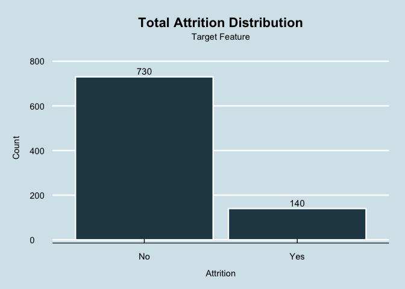

Frito Lay: Customer Attrition
================

``` r
library(tidyverse)
```

    ## ── Attaching core tidyverse packages ──────────────────────── tidyverse 2.0.0 ──
    ## ✔ dplyr     1.1.4     ✔ readr     2.1.5
    ## ✔ forcats   1.0.0     ✔ stringr   1.5.2
    ## ✔ ggplot2   3.5.2     ✔ tibble    3.3.0
    ## ✔ lubridate 1.9.4     ✔ tidyr     1.3.1
    ## ✔ purrr     1.1.0     
    ## ── Conflicts ────────────────────────────────────────── tidyverse_conflicts() ──
    ## ✖ dplyr::filter() masks stats::filter()
    ## ✖ dplyr::lag()    masks stats::lag()
    ## ℹ Use the conflicted package (<http://conflicted.r-lib.org/>) to force all conflicts to become errors

``` r
library(caret)
```

    ## Loading required package: lattice
    ## 
    ## Attaching package: 'caret'
    ## 
    ## The following object is masked from 'package:purrr':
    ## 
    ##     lift

``` r
library(e1071)
library(class)
library(ggthemes)
```

# ———— Data Loading ————-

``` r
getwd()
```

    ## [1] "/Users/cory/Projects/DDSAnalytics_customer_attrition/notebooks"

``` r
data <- read.csv("../data/CaseStudy1-data.csv")
```

# ———— Data Quality, Structure & Sanity Checks ————-

``` r
# Data Dimensionality
dim(data) 
```

    ## [1] 870  36

``` r
# Missing Values
sum(is.na(data)) 
```

    ## [1] 0

``` r
str(data)
```

    ## 'data.frame':    870 obs. of  36 variables:
    ##  $ ID                      : int  1 2 3 4 5 6 7 8 9 10 ...
    ##  $ Age                     : int  32 40 35 32 24 27 41 37 34 34 ...
    ##  $ Attrition               : chr  "No" "No" "No" "No" ...
    ##  $ BusinessTravel          : chr  "Travel_Rarely" "Travel_Rarely" "Travel_Frequently" "Travel_Rarely" ...
    ##  $ DailyRate               : int  117 1308 200 801 567 294 1283 309 1333 653 ...
    ##  $ Department              : chr  "Sales" "Research & Development" "Research & Development" "Sales" ...
    ##  $ DistanceFromHome        : int  13 14 18 1 2 10 5 10 10 10 ...
    ##  $ Education               : int  4 3 2 4 1 2 5 4 4 4 ...
    ##  $ EducationField          : chr  "Life Sciences" "Medical" "Life Sciences" "Marketing" ...
    ##  $ EmployeeCount           : int  1 1 1 1 1 1 1 1 1 1 ...
    ##  $ EmployeeNumber          : int  859 1128 1412 2016 1646 733 1448 1105 1055 1597 ...
    ##  $ EnvironmentSatisfaction : int  2 3 3 3 1 4 2 4 3 4 ...
    ##  $ Gender                  : chr  "Male" "Male" "Male" "Female" ...
    ##  $ HourlyRate              : int  73 44 60 48 32 32 90 88 87 92 ...
    ##  $ JobInvolvement          : int  3 2 3 3 3 3 4 2 3 2 ...
    ##  $ JobLevel                : int  2 5 3 3 1 3 1 2 1 2 ...
    ##  $ JobRole                 : chr  "Sales Executive" "Research Director" "Manufacturing Director" "Sales Executive" ...
    ##  $ JobSatisfaction         : int  4 3 4 4 4 1 3 4 3 3 ...
    ##  $ MaritalStatus           : chr  "Divorced" "Single" "Single" "Married" ...
    ##  $ MonthlyIncome           : int  4403 19626 9362 10422 3760 8793 2127 6694 2220 5063 ...
    ##  $ MonthlyRate             : int  9250 17544 19944 24032 17218 4809 5561 24223 18410 15332 ...
    ##  $ NumCompaniesWorked      : int  2 1 2 1 1 1 2 2 1 1 ...
    ##  $ Over18                  : chr  "Y" "Y" "Y" "Y" ...
    ##  $ OverTime                : chr  "No" "No" "No" "No" ...
    ##  $ PercentSalaryHike       : int  11 14 11 19 13 21 12 14 19 14 ...
    ##  $ PerformanceRating       : int  3 3 3 3 3 4 3 3 3 3 ...
    ##  $ RelationshipSatisfaction: int  3 1 3 3 3 3 1 3 4 2 ...
    ##  $ StandardHours           : int  80 80 80 80 80 80 80 80 80 80 ...
    ##  $ StockOptionLevel        : int  1 0 0 2 0 2 0 3 1 1 ...
    ##  $ TotalWorkingYears       : int  8 21 10 14 6 9 7 8 1 8 ...
    ##  $ TrainingTimesLastYear   : int  3 2 2 3 2 4 5 5 2 3 ...
    ##  $ WorkLifeBalance         : int  2 4 3 3 3 2 2 3 3 2 ...
    ##  $ YearsAtCompany          : int  5 20 2 14 6 9 4 1 1 8 ...
    ##  $ YearsInCurrentRole      : int  2 7 2 10 3 7 2 0 1 2 ...
    ##  $ YearsSinceLastPromotion : int  0 4 2 5 1 1 0 0 0 7 ...
    ##  $ YearsWithCurrManager    : int  3 9 2 7 3 7 3 0 0 7 ...

``` r
# Summary statistics
summary(data)
```

    ##        ID             Age         Attrition         BusinessTravel    
    ##  Min.   :  1.0   Min.   :18.00   Length:870         Length:870        
    ##  1st Qu.:218.2   1st Qu.:30.00   Class :character   Class :character  
    ##  Median :435.5   Median :35.00   Mode  :character   Mode  :character  
    ##  Mean   :435.5   Mean   :36.83                                        
    ##  3rd Qu.:652.8   3rd Qu.:43.00                                        
    ##  Max.   :870.0   Max.   :60.00                                        
    ##    DailyRate       Department        DistanceFromHome   Education    
    ##  Min.   : 103.0   Length:870         Min.   : 1.000   Min.   :1.000  
    ##  1st Qu.: 472.5   Class :character   1st Qu.: 2.000   1st Qu.:2.000  
    ##  Median : 817.5   Mode  :character   Median : 7.000   Median :3.000  
    ##  Mean   : 815.2                      Mean   : 9.339   Mean   :2.901  
    ##  3rd Qu.:1165.8                      3rd Qu.:14.000   3rd Qu.:4.000  
    ##  Max.   :1499.0                      Max.   :29.000   Max.   :5.000  
    ##  EducationField     EmployeeCount EmployeeNumber   EnvironmentSatisfaction
    ##  Length:870         Min.   :1     Min.   :   1.0   Min.   :1.000          
    ##  Class :character   1st Qu.:1     1st Qu.: 477.2   1st Qu.:2.000          
    ##  Mode  :character   Median :1     Median :1039.0   Median :3.000          
    ##                     Mean   :1     Mean   :1029.8   Mean   :2.701          
    ##                     3rd Qu.:1     3rd Qu.:1561.5   3rd Qu.:4.000          
    ##                     Max.   :1     Max.   :2064.0   Max.   :4.000          
    ##     Gender            HourlyRate     JobInvolvement     JobLevel    
    ##  Length:870         Min.   : 30.00   Min.   :1.000   Min.   :1.000  
    ##  Class :character   1st Qu.: 48.00   1st Qu.:2.000   1st Qu.:1.000  
    ##  Mode  :character   Median : 66.00   Median :3.000   Median :2.000  
    ##                     Mean   : 65.61   Mean   :2.723   Mean   :2.039  
    ##                     3rd Qu.: 83.00   3rd Qu.:3.000   3rd Qu.:3.000  
    ##                     Max.   :100.00   Max.   :4.000   Max.   :5.000  
    ##    JobRole          JobSatisfaction MaritalStatus      MonthlyIncome  
    ##  Length:870         Min.   :1.000   Length:870         Min.   : 1081  
    ##  Class :character   1st Qu.:2.000   Class :character   1st Qu.: 2840  
    ##  Mode  :character   Median :3.000   Mode  :character   Median : 4946  
    ##                     Mean   :2.709                      Mean   : 6390  
    ##                     3rd Qu.:4.000                      3rd Qu.: 8182  
    ##                     Max.   :4.000                      Max.   :19999  
    ##   MonthlyRate    NumCompaniesWorked    Over18            OverTime        
    ##  Min.   : 2094   Min.   :0.000      Length:870         Length:870        
    ##  1st Qu.: 8092   1st Qu.:1.000      Class :character   Class :character  
    ##  Median :14074   Median :2.000      Mode  :character   Mode  :character  
    ##  Mean   :14326   Mean   :2.728                                           
    ##  3rd Qu.:20456   3rd Qu.:4.000                                           
    ##  Max.   :26997   Max.   :9.000                                           
    ##  PercentSalaryHike PerformanceRating RelationshipSatisfaction StandardHours
    ##  Min.   :11.0      Min.   :3.000     Min.   :1.000            Min.   :80   
    ##  1st Qu.:12.0      1st Qu.:3.000     1st Qu.:2.000            1st Qu.:80   
    ##  Median :14.0      Median :3.000     Median :3.000            Median :80   
    ##  Mean   :15.2      Mean   :3.152     Mean   :2.707            Mean   :80   
    ##  3rd Qu.:18.0      3rd Qu.:3.000     3rd Qu.:4.000            3rd Qu.:80   
    ##  Max.   :25.0      Max.   :4.000     Max.   :4.000            Max.   :80   
    ##  StockOptionLevel TotalWorkingYears TrainingTimesLastYear WorkLifeBalance
    ##  Min.   :0.0000   Min.   : 0.00     Min.   :0.000         Min.   :1.000  
    ##  1st Qu.:0.0000   1st Qu.: 6.00     1st Qu.:2.000         1st Qu.:2.000  
    ##  Median :1.0000   Median :10.00     Median :3.000         Median :3.000  
    ##  Mean   :0.7839   Mean   :11.05     Mean   :2.832         Mean   :2.782  
    ##  3rd Qu.:1.0000   3rd Qu.:15.00     3rd Qu.:3.000         3rd Qu.:3.000  
    ##  Max.   :3.0000   Max.   :40.00     Max.   :6.000         Max.   :4.000  
    ##  YearsAtCompany   YearsInCurrentRole YearsSinceLastPromotion
    ##  Min.   : 0.000   Min.   : 0.000     Min.   : 0.000         
    ##  1st Qu.: 3.000   1st Qu.: 2.000     1st Qu.: 0.000         
    ##  Median : 5.000   Median : 3.000     Median : 1.000         
    ##  Mean   : 6.962   Mean   : 4.205     Mean   : 2.169         
    ##  3rd Qu.:10.000   3rd Qu.: 7.000     3rd Qu.: 3.000         
    ##  Max.   :40.000   Max.   :18.000     Max.   :15.000         
    ##  YearsWithCurrManager
    ##  Min.   : 0.00       
    ##  1st Qu.: 2.00       
    ##  Median : 3.00       
    ##  Mean   : 4.14       
    ##  3rd Qu.: 7.00       
    ##  Max.   :17.00

``` r
# Duplicate Analysis
sum(duplicated(data))
```

    ## [1] 0

``` r
# Columns in data
colnames(data)
```

    ##  [1] "ID"                       "Age"                     
    ##  [3] "Attrition"                "BusinessTravel"          
    ##  [5] "DailyRate"                "Department"              
    ##  [7] "DistanceFromHome"         "Education"               
    ##  [9] "EducationField"           "EmployeeCount"           
    ## [11] "EmployeeNumber"           "EnvironmentSatisfaction" 
    ## [13] "Gender"                   "HourlyRate"              
    ## [15] "JobInvolvement"           "JobLevel"                
    ## [17] "JobRole"                  "JobSatisfaction"         
    ## [19] "MaritalStatus"            "MonthlyIncome"           
    ## [21] "MonthlyRate"              "NumCompaniesWorked"      
    ## [23] "Over18"                   "OverTime"                
    ## [25] "PercentSalaryHike"        "PerformanceRating"       
    ## [27] "RelationshipSatisfaction" "StandardHours"           
    ## [29] "StockOptionLevel"         "TotalWorkingYears"       
    ## [31] "TrainingTimesLastYear"    "WorkLifeBalance"         
    ## [33] "YearsAtCompany"           "YearsInCurrentRole"      
    ## [35] "YearsSinceLastPromotion"  "YearsWithCurrManager"

``` r
#Checking out the Attrition Distribution
ggplot(data = data, mapping = aes(x = Attrition))  + 
  geom_bar() + 
  geom_text(
    stat = "count",
    aes(label = ..count..),
    vjust = -0.5,
    size = 4,
    color = "black"
  ) +
  theme_economist() +
  labs(
    title = "Total Attrition Distribution"
      )
```

    ## Warning: The dot-dot notation (`..count..`) was deprecated in ggplot2 3.4.0.
    ## ℹ Please use `after_stat(count)` instead.
    ## This warning is displayed once every 8 hours.
    ## Call `lifecycle::last_lifecycle_warnings()` to see where this warning was
    ## generated.

<!-- -->

# ————- Target Analysis —————

# Summarize the Attrition Rate

``` r
# Creates a count table (super useful!)
table(data$Attrition)
```

    ## 
    ##  No Yes 
    ## 730 140

``` r
# Gives me the proportion of each level in the target variable
prop.table(table(data$Attrition)) * 100
```

    ## 
    ##       No      Yes 
    ## 83.90805 16.09195

Frito Lays’ Attrition rate is 16.09%. This means that 16.09% of
customers have churned.

# Null Value Analysis

``` r
null_summary <- sapply(data, function(x) sum(is.na(x)))
null_summary
```

    ##                       ID                      Age                Attrition 
    ##                        0                        0                        0 
    ##           BusinessTravel                DailyRate               Department 
    ##                        0                        0                        0 
    ##         DistanceFromHome                Education           EducationField 
    ##                        0                        0                        0 
    ##            EmployeeCount           EmployeeNumber  EnvironmentSatisfaction 
    ##                        0                        0                        0 
    ##                   Gender               HourlyRate           JobInvolvement 
    ##                        0                        0                        0 
    ##                 JobLevel                  JobRole          JobSatisfaction 
    ##                        0                        0                        0 
    ##            MaritalStatus            MonthlyIncome              MonthlyRate 
    ##                        0                        0                        0 
    ##       NumCompaniesWorked                   Over18                 OverTime 
    ##                        0                        0                        0 
    ##        PercentSalaryHike        PerformanceRating RelationshipSatisfaction 
    ##                        0                        0                        0 
    ##            StandardHours         StockOptionLevel        TotalWorkingYears 
    ##                        0                        0                        0 
    ##    TrainingTimesLastYear          WorkLifeBalance           YearsAtCompany 
    ##                        0                        0                        0 
    ##       YearsInCurrentRole  YearsSinceLastPromotion     YearsWithCurrManager 
    ##                        0                        0                        0

# ————- Univariate Analysis —————

# Explore each feature individually to understand its distribution and behavior

``` r
glimpse(data)
```

    ## Rows: 870
    ## Columns: 36
    ## $ ID                       <int> 1, 2, 3, 4, 5, 6, 7, 8, 9, 10, 11, 12, 13, 14…
    ## $ Age                      <int> 32, 40, 35, 32, 24, 27, 41, 37, 34, 34, 43, 2…
    ## $ Attrition                <chr> "No", "No", "No", "No", "No", "No", "No", "No…
    ## $ BusinessTravel           <chr> "Travel_Rarely", "Travel_Rarely", "Travel_Fre…
    ## $ DailyRate                <int> 117, 1308, 200, 801, 567, 294, 1283, 309, 133…
    ## $ Department               <chr> "Sales", "Research & Development", "Research …
    ## $ DistanceFromHome         <int> 13, 14, 18, 1, 2, 10, 5, 10, 10, 10, 6, 1, 7,…
    ## $ Education                <int> 4, 3, 2, 4, 1, 2, 5, 4, 4, 4, 3, 2, 3, 1, 2, …
    ## $ EducationField           <chr> "Life Sciences", "Medical", "Life Sciences", …
    ## $ EmployeeCount            <int> 1, 1, 1, 1, 1, 1, 1, 1, 1, 1, 1, 1, 1, 1, 1, …
    ## $ EmployeeNumber           <int> 859, 1128, 1412, 2016, 1646, 733, 1448, 1105,…
    ## $ EnvironmentSatisfaction  <int> 2, 3, 3, 3, 1, 4, 2, 4, 3, 4, 1, 3, 3, 3, 4, …
    ## $ Gender                   <chr> "Male", "Male", "Male", "Female", "Female", "…
    ## $ HourlyRate               <int> 73, 44, 60, 48, 32, 32, 90, 88, 87, 92, 81, 4…
    ## $ JobInvolvement           <int> 3, 2, 3, 3, 3, 3, 4, 2, 3, 2, 2, 3, 3, 3, 3, …
    ## $ JobLevel                 <int> 2, 5, 3, 3, 1, 3, 1, 2, 1, 2, 5, 1, 3, 1, 1, …
    ## $ JobRole                  <chr> "Sales Executive", "Research Director", "Manu…
    ## $ JobSatisfaction          <int> 4, 3, 4, 4, 4, 1, 3, 4, 3, 3, 3, 4, 3, 2, 1, …
    ## $ MaritalStatus            <chr> "Divorced", "Single", "Single", "Married", "S…
    ## $ MonthlyIncome            <int> 4403, 19626, 9362, 10422, 3760, 8793, 2127, 6…
    ## $ MonthlyRate              <int> 9250, 17544, 19944, 24032, 17218, 4809, 5561,…
    ## $ NumCompaniesWorked       <int> 2, 1, 2, 1, 1, 1, 2, 2, 1, 1, 7, 1, 3, 1, 6, …
    ## $ Over18                   <chr> "Y", "Y", "Y", "Y", "Y", "Y", "Y", "Y", "Y", …
    ## $ OverTime                 <chr> "No", "No", "No", "No", "Yes", "No", "Yes", "…
    ## $ PercentSalaryHike        <int> 11, 14, 11, 19, 13, 21, 12, 14, 19, 14, 13, 1…
    ## $ PerformanceRating        <int> 3, 3, 3, 3, 3, 4, 3, 3, 3, 3, 3, 3, 4, 3, 3, …
    ## $ RelationshipSatisfaction <int> 3, 1, 3, 3, 3, 3, 1, 3, 4, 2, 4, 2, 2, 1, 3, …
    ## $ StandardHours            <int> 80, 80, 80, 80, 80, 80, 80, 80, 80, 80, 80, 8…
    ## $ StockOptionLevel         <int> 1, 0, 0, 2, 0, 2, 0, 3, 1, 1, 0, 1, 0, 1, 0, …
    ## $ TotalWorkingYears        <int> 8, 21, 10, 14, 6, 9, 7, 8, 1, 8, 21, 3, 17, 1…
    ## $ TrainingTimesLastYear    <int> 3, 2, 2, 3, 2, 4, 5, 5, 2, 3, 2, 2, 3, 3, 3, …
    ## $ WorkLifeBalance          <int> 2, 4, 3, 3, 3, 2, 2, 3, 3, 2, 3, 3, 4, 3, 4, …
    ## $ YearsAtCompany           <int> 5, 20, 2, 14, 6, 9, 4, 1, 1, 8, 16, 3, 8, 1, …
    ## $ YearsInCurrentRole       <int> 2, 7, 2, 10, 3, 7, 2, 0, 1, 2, 12, 2, 5, 0, 6…
    ## $ YearsSinceLastPromotion  <int> 0, 4, 2, 5, 1, 1, 0, 0, 0, 7, 6, 2, 1, 0, 5, …
    ## $ YearsWithCurrManager     <int> 3, 9, 2, 7, 3, 7, 3, 0, 0, 7, 14, 2, 6, 0, 7,…

# Age Distribution

``` r
ggplot(data, aes(x = Age)) + 
  geom_histogram() +
  theme_economist() +
  labs(title = "Age Distribution", x = "Age", y = "Count") + 
  theme(
    plot.title = element_text(hjust = 0.5, margin = margin(b = 12)),
    axis.title.x = element_text(margin = margin(t = 12)),
    axis.title.y = element_text(margin = margin(r = 12))
    )
```

    ## `stat_bin()` using `bins = 30`. Pick better value with `binwidth`.

<!-- -->
There is a slight right skew to the Age feature with most of the
employees being around the age of 30-40.

# Business Travel Distribution

``` r
ggplot(data, aes(x = BusinessTravel)) +
  geom_bar() +
  geom_text(
    stat = "count",
    aes(label = ..count..),
    vjust = -0.6, size = 4, color = "black"
  ) +
  scale_y_continuous(expand = expansion(mult = c(0.02, 0.15))) +  
  theme_economist() +
  labs(title = "Business Travel Distribution", x = "Business Travel", y = "Count") +
  theme(
    plot.title = element_text(hjust = 0.5, margin = margin(b = 12)),
    axis.title.x = element_text(margin = margin(t = 12)),
    axis.title.y = element_text(margin = margin(r = 12))
    )
```

<!-- -->

The majority of employees do not travel for business purposes.

# DailyRate Distribution

``` r
ggplot(data, aes(x = DailyRate)) + 
  geom_histogram(binwidth = 10) +
  theme_economist() +
  labs(title = "Daily Rate Distribution", x = "Daily Rate", y = "Count") + 
  theme(
    plot.title = element_text(hjust = 0.5, margin = margin(b = 12)),
    axis.title.x = element_text(margin = margin(t = 12)),
    axis.title.y = element_text(margin = margin(r = 12))
    )
```

<!-- -->

The Daily Rate feature appears to be uniformly distributed between 100
and 1500. No particulary useful distribution insights can be derived.

# Department Distribution

``` r
ggplot(data, aes(x = Department)) +
  geom_bar() +
  geom_text(
    stat = "count",
    aes(label = ..count..),
    vjust = -0.6, size = 4, color = "black"
  ) +
  scale_y_continuous(expand = expansion(mult = c(0.02, 0.15))) +  
  theme_economist() +
  labs(title = "Department Distribution", x = "Department", y = "Count") +
  theme(
    plot.title = element_text(hjust = 0.5, margin = margin(b = 12)),
    axis.title.x = element_text(margin = margin(t = 12)),
    axis.title.y = element_text(margin = margin(r = 12))
    )
```

<!-- -->

The majority of employees work in the Research & Development department,
followed by Sales and then Human Resources.

# DistanceFromHome Distribution

``` r
ggplot(data, aes(x = DistanceFromHome)) + 
  geom_histogram(binwidth = 1) +
  theme_economist() +
  labs(title = "Distance From Home Distribution", x = "Distance From Home (miles)", y = "Count") + 
  theme(
    plot.title = element_text(hjust = 0.5, margin = margin(b = 12)),
    axis.title.x = element_text(margin = margin(t = 12)),
    axis.title.y = element_text(margin = margin(r = 12))
    )
```

<!-- -->

There is a heavy concentration of employees living within 10 miles of
work, with a gradual decrease in number of employees as distance
increases.

# Education Distribution

``` r
ggplot(data, aes(x = Education)) +
  geom_bar() +
  geom_text(
    stat = "count",
    aes(label = ..count..),
    vjust = -0.6, size = 4, color = "black"
  ) +
  scale_y_continuous(expand = expansion(mult = c(0.02, 0.15))) +  
  theme_economist() +
  labs(title = "Education Distribution", x = "Education Level", y = "Count") +
  theme(
    plot.title = element_text(hjust = 0.5, margin = margin(b = 12)),
    axis.title.x = element_text(margin = margin(t = 12)),
    axis.title.y = element_text(margin = margin(r = 12))
    )
```

<!-- -->

Education has a normal distribution with the highest concentration of
employees centering around level 3.

# EducationField Distribution

``` r
ggplot(data, aes(x = EducationField)) +
  geom_bar() +
  geom_text(
    stat = "count",
    aes(label = ..count..),
    vjust = -0.6, size = 4, color = "black"
  ) +
  scale_y_continuous(expand = expansion(mult = c(0.02, 0.15))) +
  theme_economist() +
  labs(title = "Education Field Distribution", x = "Education Field", y = "Count") +
  theme(
    plot.title = element_text(hjust = 0.5, margin = margin(b = 12)),
    axis.title.x  = element_text(margin = margin(t = 12)),
    axis.title.y  = element_text(margin = margin(r = 12)),
    axis.text.x   = element_text(angle = 45, hjust = 1, vjust = 1)   # 👈 rotates labels
  )
```

<!-- -->

The majority of employees have a background in Life Sciences, followed
by Medical and then Marketing.

# EnvironmentalSatisfaction Distribution

``` r
ggplot(data, aes(x = EnvironmentSatisfaction)) +
  geom_bar() +
  geom_text(
    stat = "count",
    aes(label = ..count..),
    vjust = -0.6, size = 4, color = "black"
  ) +
  scale_y_continuous(expand = expansion(mult = c(0.02, 0.15))) +  
  theme_economist() +
  labs(title = "Environmental Satisfaction Distribution", x = "Environmental Satisfaction Level", y = "Count") +
  theme(
    plot.title = element_text(hjust = 0.5, margin = margin(b = 12)),
    axis.title.x = element_text(margin = margin(t = 12)),
    axis.title.y = element_text(margin = margin(r = 12))
    )
```

<!-- -->

The environmental satisfaction seems to show that more employees are
satisfied than not.

# Gender Distribution

``` r
ggplot(data, aes(x = Gender)) +
  geom_bar() +
  geom_text(
    stat = "count",
    aes(label = ..count..),
    vjust = -0.6, size = 4, color = "black"
  ) +
  scale_y_continuous(expand = expansion(mult = c(0.02, 0.15))) +  
  theme_economist() +
  labs(title = "Gender Distribution", x = "Gender", y = "Count") +
  theme(
    plot.title = element_text(hjust = 0.5, margin = margin(b = 12)),
    axis.title.x = element_text(margin = margin(t = 12)),
    axis.title.y = element_text(margin = margin(r = 12))
    )
```

<!-- -->

The gender distribution is showing that there are more Males than
females at the company.

# HourlyRate Distribution

``` r
ggplot(data, aes(x = HourlyRate)) + 
  geom_histogram(binwidth = 1) +
  theme_economist() +
  labs(title = "Hourly Rate Distribution", x = "Hourly Rate", y = "Count") + 
  theme(
    plot.title = element_text(hjust = 0.5, margin = margin(b = 12)),
    axis.title.x = element_text(margin = margin(t = 12)),
    axis.title.y = element_text(margin = margin(r = 12))
    )
```

<!-- -->

No useful distribution insights can be derived from the Hourly Rate
feature.

# JobInvolvement Distribution

``` r
ggplot(data, aes(x = JobInvolvement)) +
  geom_bar() +
  geom_text(
    stat = "count",
    aes(label = ..count..),
    vjust = -0.6, size = 4, color = "black"
  ) +
  scale_y_continuous(expand = expansion(mult = c(0.02, 0.15))) +  
  theme_economist() +
  labs(title = "Job Involvement Distribution", x = "Job Involvement Level", y = "Count") +
  theme(
    plot.title = element_text(hjust = 0.5, margin = margin(b = 12)),
    axis.title.x = element_text(margin = margin(t = 12)),
    axis.title.y = element_text(margin = margin(r = 12))
    )
```

<!-- -->

The job involvement appears to have a the majority of level 3
involvement, with level 4 being the least common.

# JobLevel Distribution

``` r
ggplot(data, aes(x = JobLevel)) +
  geom_bar() +
  geom_text(
    stat = "count",
    aes(label = ..count..),
    vjust = -0.6, size = 4, color = "black"
  ) +
  scale_y_continuous(expand = expansion(mult = c(0.02, 0.15))) +  
  theme_economist() +
  labs(title = "Job Level Distribution", x = "Job Level", y = "Count") +
  theme(
    plot.title = element_text(hjust = 0.5, margin = margin(b = 12)),
    axis.title.x = element_text(margin = margin(t = 12)),
    axis.title.y = element_text(margin = margin(r = 12))
    )
```

<!-- -->

The job level distribution shows that the majority of employees are at
level 1, with a decreasing number of employees as job level increases.

# MaritalStatus Distribution

``` r
ggplot(data, aes(x = MaritalStatus)) +
  geom_bar() +
  geom_text(
    stat = "count",
    aes(label = ..count..),
    vjust = -0.6, size = 4, color = "black"
  ) +
  scale_y_continuous(expand = expansion(mult = c(0.02, 0.15))) +  
  theme_economist() +
  labs(title = "Marital Status Distribution", x = "Marital Status", y = "Count") +
  theme(
    plot.title = element_text(hjust = 0.5, margin = margin(b = 12)),
    axis.title.x = element_text(margin = margin(t = 12)),
    axis.title.y = element_text(margin = margin(r = 12))
    )
```

<!-- -->

Most employees are single.

# MonthlyIncome Distribution

``` r
ggplot(data, aes(x = MonthlyIncome)) + 
  geom_histogram(binwidth = 500) +
  theme_economist() +
  labs(title = "Monthly Income Distribution", x = "Monthly Income", y = "Count") + 
  theme(
    plot.title = element_text(hjust = 0.5, margin = margin(b = 12)),
    axis.title.x = element_text(margin = margin(t = 12)),
    axis.title.y = element_text(margin = margin(r = 12))
    )
```

<!-- -->

The Monthly Income feature appears to be right skewed with most
employees earning between \$2000 and \$8000 per month.

# NumCompaniesWorked Distribution

``` r
ggplot(data, aes(x = NumCompaniesWorked)) + 
  geom_histogram(binwidth = .8) +
  theme_economist() +
  labs(title = "Number of Companies Worked Distribution", x = "Number of Companies Worked", y = "Count") + 
  theme(
    plot.title = element_text(hjust = 0.5, margin = margin(b = 12)),
    axis.title.x = element_text(margin = margin(t = 12)),
    axis.title.y = element_text(margin = margin(r = 12))
    )
```

<!-- -->

The number of companies worked feature appears to be right skewed with
most employees having worked at 1-3 companies prior to their current
employment.

# OverTime Distribution

``` r
ggplot(data, aes(x = OverTime)) +
  geom_bar() +
  geom_text(
    stat = "count",
    aes(label = ..count..),
    vjust = -0.6, size = 4, color = "black"
  ) +
  scale_y_continuous(expand = expansion(mult = c(0.02, 0.15))) +  
  theme_economist() +
  labs(title = "OverTime Distribution", x = "OverTime", y = "Count") +
  theme(
    plot.title = element_text(hjust = 0.5, margin = margin(b = 12)),
    axis.title.x = element_text(margin = margin(t = 12)),
    axis.title.y = element_text(margin = margin(r = 12))
    )
```

<!-- -->

Majority of employees do not work overtime.

# PercentSalaryHike Distribution

``` r
ggplot(data, aes(x = PercentSalaryHike)) + 
  geom_histogram(binwidth = 1) +
  theme_economist() +
  labs(title = "Percent Salary Hike Distribution", x = "Percent Salary Hike", y = "Count") + 
  theme(
    plot.title = element_text(hjust = 0.5, margin = margin(b = 12)),
    axis.title.x = element_text(margin = margin(t = 12)),
    axis.title.y = element_text(margin = margin(r = 12))
    )
```

<!-- -->

Percent Salary hike is demonstrating a heavy right skew with most
employees receiving between 10-15% salary hikes.

# PerformanceRating Distribution

``` r
ggplot(data, aes(x = PerformanceRating)) +
  geom_bar() +
  geom_text(
    stat = "count",
    aes(label = ..count..),
    vjust = -0.6, size = 4, color = "black"
  ) +
  scale_y_continuous(expand = expansion(mult = c(0.02, 0.15))) +  
  theme_economist() +
  labs(title = "Performance Rating Distribution", x = "Performance Rating", y = "Count") +
  theme(
    plot.title = element_text(hjust = 0.5, margin = margin(b = 12)),
    axis.title.x = element_text(margin = margin(t = 12)),
    axis.title.y = element_text(margin = margin(r = 12))
    )
```

<!-- -->

Majority of employees have a performance rating of 3, with very few
employees receiving a rating of 4.

# RelationshipSatisfaction Distribution

``` r
ggplot(data, aes(x = RelationshipSatisfaction)) +
  geom_bar() +
  geom_text(
    stat = "count",
    aes(label = ..count..),
    vjust = -0.6, size = 4, color = "black"
  ) +
  scale_y_continuous(expand = expansion(mult = c(0.02, 0.15))) +  
  theme_economist() +
  labs(title = "Relationship Satisfaction Distribution", x = "Relationship Satisfaction Level", y = "Count") +
  theme(
    plot.title = element_text(hjust = 0.5, margin = margin(b = 12)),
    axis.title.x = element_text(margin = margin(t = 12)),
    axis.title.y = element_text(margin = margin(r = 12))
    )
```

<!-- -->

Majority of employees have a relationship satisfaction level of 3 or 4,
with level 2 being the least common by a slim margin.

# StandardHours Distribution

``` r
ggplot(data, aes(x = StandardHours)) +
  geom_bar() +
  geom_text(
    stat = "count",
    aes(label = ..count..),
    vjust = -0.6, size = 4, color = "black"
  ) +
  scale_y_continuous(expand = expansion(mult = c(0.02, 0.15))) +  
  theme_economist() +
  labs(title = "Standard Hours Distribution", x = "Standard Hours", y = "Count") +
  theme(
    plot.title = element_text(hjust = 0.5, margin = margin(b = 12)),
    axis.title.x = element_text(margin = margin(t = 12)),
    axis.title.y = element_text(margin = margin(r = 12))
    )
```

<!-- -->

All employees have standard hours of 80.

# StockOptionLevel Distribution

``` r
ggplot(data, aes(x = StockOptionLevel)) +
  geom_bar() +
  geom_text(
    stat = "count",
    aes(label = ..count..),
    vjust = -0.6, size = 4, color = "black"
  ) +
  scale_y_continuous(expand = expansion(mult = c(0.02, 0.15))) +  
  theme_economist() +
  labs(title = "Stock Option Level Distribution", x = "Stock Option Level", y = "Count") +
  theme(
    plot.title = element_text(hjust = 0.5, margin = margin(b = 12)),
    axis.title.x = element_text(margin = margin(t = 12)),
    axis.title.y = element_text(margin = margin(r = 12))
    )
```

<!-- -->

Majority of employees have a stock option level of 0, with very few
employees having a stock option level of 3.

# TotalWorkingYears Distribution

``` r
ggplot(data, aes(x = TotalWorkingYears)) + 
  geom_histogram(binwidth = 1) +
  theme_economist() +
  labs(title = "Total Working Years Distribution", x = "Total Working Years", y = "Count") + 
  theme(
    plot.title = element_text(hjust = 0.5, margin = margin(b = 12)),
    axis.title.x = element_text(margin = margin(t = 12)),
    axis.title.y = element_text(margin = margin(r = 12))
    )
```

<!-- -->

The Total Working Years feature appears to be right skewed with most
employees having between 0-10 years of total working experience.

# TrainingTimesLastYear Distribution

``` r
ggplot(data, aes(x = TrainingTimesLastYear)) +
  geom_bar() +
  geom_text(
    stat = "count",
    aes(label = ..count..),
    vjust = -0.6, size = 4, color = "black"
  ) +
  scale_y_continuous(expand = expansion(mult = c(0.02, 0.15))) +  
  theme_economist() +
  labs(title = "Training Times Last Year Distribution", x = "Training Times Last Year", y = "Count") +
  theme(
    plot.title = element_text(hjust = 0.5, margin = margin(b = 12)),
    axis.title.x = element_text(margin = margin(t = 12)),
    axis.title.y = element_text(margin = margin(r = 12))
    )
```

<!-- -->

Majority of employees have undergone training 2-3 times in the last
year.

# WorkLifeBalance Distribution

``` r
ggplot(data, aes(x = WorkLifeBalance)) +
  geom_bar() +
  geom_text(
    stat = "count",
    aes(label = ..count..),
    vjust = -0.6, size = 4, color = "black"
  ) +
  scale_y_continuous(expand = expansion(mult = c(0.02, 0.15))) +  
  theme_economist() +
  labs(title = "Work Life Balance Distribution", x = "Work Life Balance Level", y = "Count") +
  theme(
    plot.title = element_text(hjust = 0.5, margin = margin(b = 12)),
    axis.title.x = element_text(margin = margin(t = 12)),
    axis.title.y = element_text(margin = margin(r = 12))
    )
```

<!-- -->

Majority of employees have a work life balance level of 3, with level 1
being the least common.

# YearsAtCompany Distribution

``` r
ggplot(data, aes(x = YearsAtCompany)) + 
  geom_histogram(binwidth = 1) +
  theme_economist() +
  labs(title = "Years At Company Distribution", x = "Years At Company", y = "Count") + 
  theme(
    plot.title = element_text(hjust = 0.5, margin = margin(b = 12)),
    axis.title.x = element_text(margin = margin(t = 12)),
    axis.title.y = element_text(margin = margin(r = 12))
    )
```

<!-- -->

The Years At Company feature appears to be right skewed with most
employees having between 0-10 years at the company.

# YearsInCurrentRole Distribution

``` r
ggplot(data, aes(x = YearsInCurrentRole)) + 
  geom_histogram(binwidth = 1) +
  theme_economist() +
  labs(title = "Years In Current Role Distribution", x = "Years In Current Role", y = "Count") + 
  theme(
    plot.title = element_text(hjust = 0.5, margin = margin(b = 12)),
    axis.title.x = element_text(margin = margin(t = 12)),
    axis.title.y = element_text(margin = margin(r = 12))
    )
```

<!-- -->

The Years In Current Role feature appears to be right skewed with most
employees having between 0-7 years in their current role.

# YearsSinceLastPromotion Distribution

``` r
ggplot(data, aes(x = YearsSinceLastPromotion)) + 
  geom_histogram(binwidth = 1) +
  theme_economist() +
  labs(title = "Years Since Last Promotion Distribution", x = "Years Since Last Promotion", y = "Count") + 
  theme(
    plot.title = element_text(hjust = 0.5, margin = margin(b = 12)),
    axis.title.x = element_text(margin = margin(t = 12)),
    axis.title.y = element_text(margin = margin(r = 12))
    )
```

<!-- -->

The Years Since Last Promotion feature appears to be right skewed with
most employees having between 0-3 years since their last promotion.

# YearsWithCurrManager Distribution

``` r
ggplot(data, aes(x = YearsWithCurrManager)) + 
  geom_histogram(binwidth = 1) +
  theme_economist() +
  labs(title = "Years With Current Manager Distribution", x = "Years With Current Manager", y = "Count") + 
  theme(
    plot.title = element_text(hjust = 0.5, margin = margin(b = 12)),
    axis.title.x = element_text(margin = margin(t = 12)),
    axis.title.y = element_text(margin = margin(r = 12))
    )
```

<!-- -->

The Years With Current Manager feature appears to be right skewed with
most employees having between 0-7 years with their current manager.

# ———— Multivariate Analysis ————-
